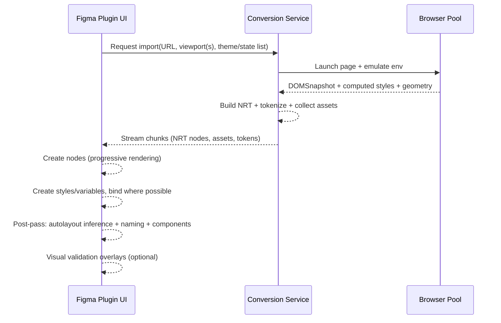

# HTML/CSS to Pixel-Perfect Figma: Systems, Algorithms, and Implementation Roadmap

## Executive summary

Tools like html.to.design convert arbitrary webpages into editable designs by **rendering the page in a real browser engine**, extracting a **post-layout representation** (DOM structure + computed styles + geometry), and compiling that into **Figma nodes** (frames, text, vectors, images) along with reusable **styles/variables (“design tokens”)**. html.to.design explicitly ships as a **Figma plugin + a browser extension** to capture what you see in-browser (including private/authenticated pages), and it automatically creates reusable **text and color styles** in Figma; it also advertises optional Auto Layout generation and even hover states as component variants. citeturn8view0turn9view0

A pixel-perfect converter cannot realistically re-implement the entire CSS layout/paint stack; the practical path is to treat the browser as the “layout oracle” and use instrumentation APIs to extract:
- **Computed styles** (including pseudo-elements, keyframes, platform font usage) via the Chrome DevTools Protocol (CDP) CSS domain. citeturn4view0  
- **Box model + transformed geometry** via CDP DOM domain (box model and “content quads”). citeturn14view0turn14view1  
- **Full-document snapshots** that include DOM, layout, and whitelisted computed style fields via `DOMSnapshot.captureSnapshot`, with a complementary path to archive a page + resources using MHTML snapshots. citeturn5search0turn7view1  

On the Figma side, fidelity + editability depends on mapping web layout semantics to Figma’s layout system:
- Create node trees using the Plugin API (nodes, paints, effects, text, vectors, images, SVG import). citeturn12search14turn13search1  
- Represent responsiveness using **Auto Layout** (including the newer GRID mode) and child sizing/positioning controls (wrapping, fixed vs hug vs fill, absolute positioning inside Auto Layout, border-box behavior). citeturn18view0turn19search2turn19search3turn19search30turn19search4  
- Generate token artifacts using **Figma Variables** (explicitly described as design tokens) and local styles. citeturn12search8turn12search1turn13search1turn13search9  

The hard problems you must engineer around are:
- **Typography parity** (font availability, metrics, line-height/letter-spacing, mixed styles). Figma plugins can only access fonts available in the editor and must load them explicitly; missing fonts are a first-class failure mode. citeturn12search14turn9view0turn21search6  
- **Stacking/painting differences** (stacking contexts, blending, filters) where Figma and browsers diverge; you need rasterization fallbacks where exact reproduction is impossible.
- **Scale/performance** (large pages; too many node/style calls). You need batching, snapshots, caching, and incremental processing.

The rest of this report decomposes the system into implementable components, describes extraction and reconstruction algorithms, and proposes a pragmatic roadmap that starts with a pixel-perfect “baseline” and incrementally increases editability without losing fidelity.

## Landscape of existing tools and how they position the problem

html.to.design positions itself as a **website → editable Figma** workflow built from a **plugin + browser extension**, explicitly supporting captures of private pages behind logins, multi-viewport imports, dark/light themes, auto layout generation, style creation, and hover effects as variants. citeturn8view0turn9view0 It also advertises higher-quality image imports and font replacement/mapping when fonts are missing. citeturn9view0

A key strategic observation: the “HTML → Figma” category is narrow and specialized; several widely used tools adjacent to it focus on **Figma → code** (handoff/production), and their limitations are instructive because they expose where design/code representations mismatch.

### Comparison table of six services/tools

The table below focuses on what you asked for: fidelity, token/style extraction, and the integration surface (Figma plugin vs external service). Descriptions stick to what vendors document publicly.

| Tool / service | Direction | Core promise | Fidelity claim / notes | Token / style extraction | Figma integration surface | Licensing / plan notes |
|---|---|---|---|---|---|---|
| html.to.design | Webpage/HTML → Figma | Convert websites into “fully editable Figma designs” via plugin + extension, including private pages behind login. citeturn8view0turn9view0 | Emphasizes “accurate, high‑quality imports” and supports complex gradients + auto layout (optional). citeturn9view0 | Creates text & color styles as local styles; can apply existing local styles. citeturn8view0turn9view0 | Figma plugin + Chromium extension. citeturn8view0turn10search26 | PRO “unlimited” with fair-use cap (1,000 imports/month). citeturn11search0turn9view0 |
| entity["company","Builder.io","visual copilot platform"] (Website→Figma workflow) | Webpage/HTML → Figma | “Paste a URL… transform… into fully editable Figma designs”; includes a Chrome extension to copy layout and import selected sections. citeturn10search0turn10search4turn10search11 | Publishes a typical accuracy band (80–90%) and notes ongoing work on complex layouts/dynamic content; Auto Layout support described as beta. citeturn10search11turn10search0 | Not positioned as token extraction; primarily imports structure/styling, then may use AI features for variants. citeturn10search11turn10search0 | Figma plugin + Chrome extension import flow. citeturn10search4turn10search11 | Blog notes free + premium features (claims “no credit card” for free features). citeturn10search11 |
| Anima | Figma → code (adjacent) | Export production code and responsive pages from Figma; offers an “API/SDK” and “website clones” in plans. citeturn1search25 | Fidelity varies by layout complexity; useful as reference for responsive mapping limits rather than HTML→Figma. (Vendor does not present itself as HTML→Figma.) citeturn1search7turn1search25 | Token extraction not positioned as primary; more about code generation/handoff. citeturn1search25 | Figma plugin-based workflow. citeturn1search7 | Tiered SaaS pricing incl. Enterprise; API/SDK appears in higher tiers. citeturn1search25 |
| TeleportHQ | Figma → HTML/CSS (adjacent) | Export Figma frames to HTML/CSS (and other frameworks) and validate quickly. citeturn11search9 | Public limitation list is valuable: text rotation, certain blur types, and other effects are called out as problematic. citeturn1search6 | Mentions “global style guide” and “smart media queries” in marketing, but not “design token extraction” in the DTCG sense. citeturn11search36turn11search1 | Figma plugin plus TeleportHQ platform. citeturn11search9turn11search1 | Free plan includes limited projects/exports; plugin promoted as free to get. citeturn11search9turn11search1 |
| Locofy | Figma → code (adjacent) | Convert Figma/Penpot to developer-friendly code across multiple frameworks. citeturn11search2turn11search10 | Focus is code output with responsive behavior; not an HTML→Figma importer. citeturn11search2turn11search10 | Token extraction not central in positioning; typically design-to-code alignment. citeturn11search2 | Figma plugin workflow (vendor positioning). citeturn11search10turn11search2 | Pricing page positions multi-framework output; contract/licensing via site terms. citeturn11search2turn11search33 |
| Uizard | Screenshot/idea → editable mockups (adjacent) | “Screenshot Scanner” converts screenshots into editable mockups in its own editor. citeturn10search3turn10search7 | Good for structure approximation; not inherently pixel-perfect to a webpage DOM/CSS and not positioned as HTML→Figma. citeturn10search3 | Token extraction not a core positioning. citeturn10search2turn10search3 | Has a Figma→Uizard plugin (direction is opposite). citeturn10search9 | Tiered pricing (public pricing page). citeturn10search2 |

image_group{"layout":"carousel","aspect_ratio":"16:9","query":["html.to.design Figma plugin import webpage screenshot","Builder.io website to Figma plugin import URL screenshot","TeleportHQ Figma export to HTML plugin screenshot","Anima Figma plugin export to code screenshot","Locofy Figma plugin screenshot","Uizard screenshot scanner interface"],"num_per_query":1}

## Reference architecture and key system components

A robust HTML→Figma pipeline is best designed as **two coupled products**:

- A **capture/runtime** that can render arbitrary pages and extract accurate layout/style data.
- A **Figma-side compiler** that builds node graphs, styles, and variables in a real Figma file.

html.to.design’s public docs align with exactly this split: it is “made up of a Figma plugin and a browser extension” to capture pages (including authenticated pages) and import results into Figma. citeturn8view0

### Architecture diagram

```mermaid
flowchart LR
  A[Input: URL or HTML/CSS bundle] --> B[Render Orchestrator]
  B --> C[Headless Browser Pool\nChromium/WebKit/Firefox]
  C --> D[Instrumentation Layer\nCDP / JS probes]
  D --> E[Normalized Render Tree (NRT)\nDOM + computed styles + geometry + paint order]
  E --> F[Asset Extractor\nimages, SVG, fonts metadata]
  E --> G[Token Miner\ncolors, typography, spacing, radii, shadows]
  F --> H[Packaging\nmanifest + binary assets]
  G --> H
  H --> I[Figma Importer\nPlugin UI]
  I --> J[Figma Node Builder\nframes/text/vectors/images]
  I --> K[Figma Styles & Variables Builder]
  J --> L[Output: Editable Figma page\n+ components + variants]
  K --> L
```

The browser “instrumentation layer” should use:
- **CSS domain** for computed styles, matched rules, pseudo-elements, keyframes, platform fonts. citeturn4view0  
- **DOM domain** for box model and transformed geometry. citeturn14view0turn14view1  
- **DOMSnapshot** for whole-document snapshots including DOM tree, layout, and whitelisted computed style fields. citeturn5search0  
- Optionally, **MHTML snapshots** when you need an archival, re-runnable representation of a page including resources (useful for reproducibility). citeturn7view1turn6search21  

On the Figma side, you will mainly rely on the **Plugin API**, because it can create and modify nodes directly in the editor. citeturn12search14turn13search1 The REST API is excellent for reading/analyses and some writes, but the “HTML→editable layers in a file the user is currently in” experience is typically plugin-centric. citeturn12search2

### Data-flow diagram and on-disk interchange format

To support large pages and incremental import, define a versioned interchange format. A practical approach is:

- `manifest.json`: viewport, dpr, URL, timestamp, capture options, list of “screens/states”
- `nrt.json`: normalized render tree (node list + parent pointers + geometry + simplified style)
- `tokens.json`: tokens in DTCG/JSON form (plus mapping references)
- `assets/…`: images, SVG, optional font files (if you control licensing), plus hashes



The “DTCG JSON format unlocks interoperability and theming between tools,” and the DTCG publishes a formal “Design Tokens Format Module” specification describing a token exchange file format. citeturn22search0turn22search16 For production, you should treat the DTCG format as your canonical `tokens.json`, because it is explicitly designed for cross-tool exchange. citeturn22search4turn22search14

## Core conversion algorithms and heuristics

This section is written as a blueprint: if you implement the stages below in order, you will converge toward pixel-perfect output while still producing editable artifacts.

### Rendering and environment control

To produce deterministic layout, you must pin down:
- Viewport dimensions and device scale factor (DPR), which affect layout and media queries. CDP exposes `Emulation.setDeviceMetricsOverride` for overriding screen/innerWidth/innerHeight and device-width/device-height media query results. citeturn20search1  
- User-preference media features such as `prefers-color-scheme` and `prefers-reduced-motion`. Puppeteer exposes `page.emulateMediaFeatures()` for these, and DevTools documents the same classes of emulation. citeturn20search2turn20search0  
- Media queries more broadly: Media Queries Level 5 documents light/dark preferences and other user preference features and notes that preference media features can be fingerprinting risks; in production you should treat them as sensitive environment signals. citeturn15search0turn15search21  

In practice, capture multiple “screens”:
- Desktop/tablet/mobile viewports (mirroring html.to.design’s “Multi-viewport” feature). citeturn9view0  
- Light/dark themes, if the page responds to `prefers-color-scheme` (mirroring html.to.design “Dark and light themes”). citeturn9view0turn15search3  
- Reduced-motion mode to stabilize animation-heavy pages. citeturn20search2turn20search0  

### DOM and style extraction: computed state beats authored state

For pixel-perfect geometry, you want **computed styles** and **post-layout boxes**.

**Computed style extraction**
- CDP `CSS.getComputedStyleForNode` returns computed style for a given node. citeturn4view0  
- CDP `CSS.getMatchedStylesForNode` can return matched rules, pseudo-element matches, inherited style chain, and keyframes rules—critical if you want to trace token references like `var(--brand)` rather than only the final computed value. citeturn4view0  
- CDP `CSS.forcePseudoState` lets you force pseudo classes (e.g., `:hover`) at computation time, which is an enabling technique for capturing interactive states as component variants. citeturn4view0turn9view0  
- If you need to know which fonts were actually used after fallback resolution, CDP exposes `CSS.getPlatformFontsForNode`. citeturn4view0  

**Geometry extraction**
- CDP `DOM.getBoxModel` returns box model geometry. citeturn14view0  
- CDP `DOM.getContentQuads` returns quads describing node position on the page and may return multiple quads for inline nodes; this is particularly useful for transformed and inline layout cases. citeturn14view1  

**Whole-document extraction (performance lever)**
- `DOMSnapshot.captureSnapshot` returns a document snapshot including the full DOM tree and includes layout and “white-listed computed style information.” citeturn5search0  
This is valuable for large pages because it can reduce per-node round trips at the cost of upfront payload size.

**Pseudo-elements**
Pseudo-elements represent abstract parts of the render tree (e.g., `::before`, `::after`) that can be styled and can add generated content. citeturn15search4turn15search11 In practice, you’ll treat pseudo-elements as synthetic nodes inserted into the NRT to preserve layout and styling.

### Layout reconstruction and stacking context

A converter that builds editable layers must reconstruct not only geometry but also **paint order**.

**Stacking context reconstruction (core idea)**
Browser paint order follows stacking context rules (e.g., which elements create a stacking context, how z-index is applied). For a rigorous implementation, build a “Stacking Context Tree” (SCT) as you walk nodes:
- A node creates a new stacking context based on computed properties such as positioned z-index, opacity, transforms, etc. (summarized well in developer references and in CSS specs; use the spec rules as the source of truth for your implementation). citeturn4view0turn3search1turn3search3  

Then compute paint order inside each context and map that to:
- Figma child ordering (later nodes draw on top in typical layer stacks).
- Auto Layout’s `itemReverseZIndex` where relevant (for auto layout frames). citeturn18view0turn19search11  

**Transforms**
Treat transforms as first-class:
- Parse computed `transform` into a 2D/3D matrix and project into Figma’s 2D transform model (when possible), otherwise rasterize.
- Use `DOM.getContentQuads` to validate transformed bounds. citeturn14view1  

### Responsive layouts: flex, grid, and constraints mapping

A pixel-perfect converter can be “frozen” at one viewport, but you explicitly want “preserve constraints” and map to Auto Layout. This is both feasible and invasive (because converting absolute-positioned DOM into layout containers changes editability and sometimes geometry).

**Detect layout intent**
Compute layout intent per element:
- If `display:flex`, map to Auto Layout HORIZONTAL/VERTICAL depending on `flex-direction`.
- If `display:grid`, consider mapping to Auto Layout `layoutMode: 'GRID'` (supported in Plugin API). citeturn18view0turn19search4turn19search7  
- Otherwise, treat as a Frame with absolute child positioning (or attempt inference, below).

**Map flex to Auto Layout**
Figma Auto Layout is controlled by:
- `layoutMode` (NONE/HORIZONTAL/VERTICAL/GRID). citeturn18view0  
- Alignment: `primaryAxisAlignItems`, `counterAxisAlignItems`, and wrapping controls (`layoutWrap`, `counterAxisAlignContent`). citeturn18view0turn19search8  
- Spacing: `itemSpacing`, `counterAxisSpacing`, padding. citeturn18view0turn19search8  
- Box sizing: `strokesIncludedInLayout` explicitly makes Auto Layout behave like CSS `box-sizing: border-box`. citeturn19search3  

This set of API hooks is surprisingly close to what you need for CSS flexbox + gap + padding translation.

**Map grid to Auto Layout GRID**
Figma’s Plugin API supports GRID mode with:
- `gridRowCount`, `gridColumnCount`, row/column gaps, and methods like `appendChildAt` and `setGridChildPosition`. citeturn19search4turn19search7turn19search20turn19search0  

When CSS grid templates are complex (minmax, auto-fit, named lines), you’ll often need to approximate:
- Use observed layout (actual column widths/row heights) and create explicit track sizes (`gridRowSizes`, `gridColumnSizes`) where possible. citeturn19search17turn19search22  

**Absolute positioning inside Auto Layout**
For mixed layouts (common on the web), you can keep a parent as Auto Layout but set specific children to manual positioning using `layoutPositioning`. citeturn19search2  
This supports a hybrid strategy: preserve the overall responsive container while allowing “decorative” or overlay layers to remain absolutely positioned.

### Dynamic content, animations, and interactive states

**Dynamic content**
Dynamic pages introduce two distinct requirements:
1) Decide *when* to snapshot (after navigation, after hydration, after user flows).  
2) Capture “states” (e.g., menu open) as separate frames/variants.

**Pseudo-classes and state forcing**
- Use `CSS.forcePseudoState` to compute styles for hover/active/focus. citeturn4view0  
- html.to.design explicitly advertises importing hover effects as components with variants, which matches this strategy. citeturn9view0  

**Animations**
You can extract keyframes via CDP (matched styles include keyframes rules) and CDP has experimental APIs for animated styles; however, Figma is not a timeline animation engine in the same way CSS is. citeturn4view0  
Pragmatically:
- Freeze animations for your “default” capture (emulate reduced motion + inject CSS to disable animations).
- Capture key interactive states as variants (default/hover/pressed/disabled) rather than trying to port the animation itself.

## Tokenization and Figma artifact generation

Your goal is “HTML → design tokens (and Figma-compatible design artifacts) in a pixel-perfect way.” This implies two outputs:
1) A **literal reconstruction** of what’s on screen (node properties).
2) A **tokenized representation** that captures repeating design decisions and binds nodes to those reusable values.

### Token model: use DTCG as the canonical interchange

The Design Tokens W3C Community Group (DTCG) exists specifically to standardize how tokens are defined and exchanged at scale. citeturn22search4turn22search1 The DTCG publishes a “Design Tokens Format Module” describing a file format for exchanging tokens between tools. citeturn22search16turn22search0  

For a real system, treat your **normalized token output** as:
- DTCG JSON tokens (`$value`, `$type`, etc.) suitable for use in code pipelines and design tooling. citeturn22search0turn22search16  
- A build step using Style Dictionary (or similar) if you want multi-platform token exports; Style Dictionary describes itself as a system that uses design tokens once and exports to many platforms, and it now positions itself as forward-compatible with the DTCG spec. citeturn22search6turn22search8turn22search12  

### How to mine tokens from computed CSS

Token extraction is ultimately a **clustering + naming + binding** problem.

**Colors**
- Extract all computed colors for fills, borders, text, shadows (as RGBA).
- Normalize into a stable color space (e.g., sRGB RGBA).
- Cluster by exact match first; then consider perceptual clustering for near-equal values (beware: near-equal colors can be distinct tokens in real systems).
- Bind high-frequency colors to tokens like `color.surface.1`, `color.text.primary`, etc.

To preserve author intent, also inspect matched styles for `var(--token)` usage:
- `CSS.getMatchedStylesForNode` can expose the authored declarations and matched rules, which may include `var()` references rather than only the resolved computed value. citeturn4view0turn15search12  
- CSS custom properties participate in the cascade and their computed value is “as specified with variables substituted,” so preserving the reference graph requires looking above computed values. citeturn15search2turn15search1  

**Typography**
Typography tokens are composites:
- CSS font-family/weight/style
- size
- line-height
- letter-spacing
- text-transform, decoration

On the Figma side:
- Text nodes support mixed styles and require explicit font loading; this impacts token binding because you must ensure font availability and load it before setting. citeturn21search0turn21search6turn12search14  
- Figma represents line height and letter spacing as typed units (pixels/percent or AUTO). citeturn21search1turn21search2  

A practical token mining approach:
- Build a histogram of (family, weight, size, lineHeight, letterSpacing) tuples.
- Promote repeated tuples into text styles (Figma local text styles) and/or typography variables (if you prefer variable-first design systems).

**Spacing, radii, borders, shadows**
- Spacing candidates: padding, margin, gap, row/column gaps.
- Radii: border-radius per-corner values (tokenize common radii like 4/8/12).
- Borders: width + color tuples.
- Shadows: box-shadow tuples (multiple shadows are common; tokenize common effects).

### Generating Figma-compatible artifacts: variables, styles, and bindings

You can create:
- **Local styles**: paint styles, text styles, effect styles (Plugin API supports `createPaintStyle`, `createTextStyle`, `createEffectStyle`). citeturn13search1turn13search16  
- **Variables**: explicitly described as design tokens that define values per mode within a collection. citeturn12search8turn12search24  

Modes are how you represent themes like Light/Dark:
- Variable collections have modes; variables can set per-mode values. citeturn12search12turn12search5  
- html.to.design’s “dark and light themes” import aligns naturally with creating two modes and binding colors accordingly. citeturn9view0turn15search3  

**Automatic vs inferred binding**
Figma’s Plugin API supports “inferred variables” to infer variable candidates when raw values match exactly, which can power a post-pass that binds literal properties to variables. citeturn19search1  

### Asset extraction: images, SVGs, icons, and fonts

**Raster images**
- Extract `` sources, CSS background images, and higher-resolution candidates (srcset, computed background-image URLs).
- In Figma, create image paints via the Paint model (image paints exist as a Paint type) and create image resources via the `createImage` workflow. citeturn12search11turn13search1  
- html.to.design advertises “high-res images” when improved versions are available, implying a real-world need to dedupe, upgrade, and cache assets. citeturn9view0  

**SVG and vector shapes**
- For actual `<svg>` elements (inline or fetched), import by feeding the SVG string via `createNodeFromSvg`, which is described as equivalent to the editor’s SVG import. citeturn13search1turn13search10  
- For CSS-drawn shapes (borders, radii), prefer native rectangles and vector nodes, because they remain editable.

**Fonts**
Font handling is both technical and legal:
- Figma plugins cannot access “external fonts or web fonts accessed via a URL”; they can only access fonts accessible in the editor and must load them via `loadFontAsync`. citeturn12search14turn21search6  
- Missing-font detection is a supported workflow (`hasMissingFont` exists on TextNode), and html.to.design ships explicit “Replace missing fonts” behavior. citeturn21search0turn9view0  

That means “pixel-perfect typography” is conditional: you need either (a) identical fonts available in Figma or (b) a controlled fallback strategy with explicit font mapping.

### Layer grouping, naming, and components

Editable output is only useful if it’s navigable.

A pragmatic naming strategy:
- Use semantic sources: tag names, ARIA labels, accessible names, `data-testid`, and text content snippets.
- Deduplicate repeated patterns into components (navbars, cards, buttons).

Figma component/variant workflows are accessible via the Plugin API (components and variants APIs are exposed on `figma`), and reactions can be set by plugin for prototyping flows if you choose to preserve hyperlink navigation. citeturn13search1turn12search19  
html.to.design advertises “automatic linking” for prototype flows and hover effects imported as variants, which is consistent with building component sets from multiple captured states. citeturn9view0

## Fidelity, performance, testing, security, and implementation roadmap

### Fidelity vs editability trade-offs

A pixel-perfect pipeline should explicitly score each node for “editability potential” and decide among:
1) **Native editable primitives** (best): frames, rectangles, text, vectors.
2) **Hybrid**: editable container + rasterized decoration/filter/mask.
3) **Full raster** (last resort): element screenshot placed as an image.

TeleportHQ’s public limitation list (for a different direction: design→code) is a reminder that even adjacent tools hit feature cliffs (e.g., blur behavior, rotated text), so you should design for graceful degradation with fallbacks rather than all-or-nothing conversion. citeturn1search6turn13search9

### Performance, scalability, and incremental conversion for large pages

**Key constraints**
- CDP calls per node do not scale linearly to 10k nodes; you need batching.
- Asset downloads dominate time if uncached.
- Figma node creation itself becomes slow with extremely deep/large layer trees.

**Practical performance tactics**
- Prefer `DOMSnapshot.captureSnapshot` for bulk DOM+layout extraction, then only call `CSS.getComputedStyleForNode` for nodes you keep (visible nodes, nodes with paint/text). citeturn5search0turn4view0  
- Stream conversion in “chunks” to the plugin UI and build progressively (build above-the-fold first).
- Defer complex operations (auto layout inference, component detection, token binding) to post-passes that can run on the already-built tree.
- Cache assets by URL + hash; store hashes in plugin data for incremental re-imports (Plugin API supports plugin data storage on nodes/styles). citeturn12search0turn19search12  
- For reproducibility and diffing, consider capturing an MHTML snapshot of the page (includes iframes/resources/inline styles) as a stable input artifact. citeturn7view1turn6search21  

### Testing and validation methods

Your acceptance criteria should be measurable.

**Visual diffing**
- Use Playwright screenshot comparisons (`expect(page).toHaveScreenshot()`) for deterministic regression testing of the *web capture* stage. citeturn5search12  
- For comparing rendered output images (web render vs Figma render export), use pixel-level diffs such as `pixelmatch` (pixel-level comparisons with anti-aliasing detection and perceptual color difference metrics). citeturn17search0  
- Complement with perceptual hashing when exact pixel equality is too strict: pHash is an open-source perceptual hashing library family for similarity comparisons. citeturn17search2turn17search26  

**What to test**
- Multi-viewport fidelity (desktop/tablet/mobile). citeturn9view0  
- Theme parity (light/dark if applicable). citeturn9view0turn15search3  
- Hover/pressed variants for key components, using forced pseudo states. citeturn4view0turn9view0  
- Text metrics: compare bounding boxes and line wraps; track “wrap deltas” separately from color/layout deltas.

### Security and privacy considerations for processing remote pages

If your product fetches and processes arbitrary URLs, you are operating in a threat model where:
- **SSRF** is a top concern: SSRF occurs when an application fetches a remote resource without validating the user-supplied URL; it can allow attackers to coerce requests to internal networks or metadata services. citeturn23search2turn23search5  
- OWASP provides explicit SSRF prevention guidance in its cheat sheet series. citeturn23search1  
- Headless browser sandboxing matters: Chrome uses multiple layers of sandboxing to protect the host from untrusted web content; Puppeteer documents that disabling the sandbox (`--no-sandbox`) is only for cases where you *absolutely trust* content. citeturn23search3  

**Minimum recommended controls**
- URL allow/deny policies (block localhost, RFC1918, link-local), DNS pinning, and egress filtering aligned to OWASP guidance. citeturn23search1turn23search2  
- Run browsers in locked-down containers/users (avoid root + no-sandbox), and treat the renderer as untrusted. citeturn23search3turn23search0  
- Be careful with “universal access” capabilities in browser instrumentation; CDP includes powerful options that are explicitly labeled as requiring caution. citeturn7view0  
- Treat user preference media features and environment signals as potentially sensitive/fingerprinting-relevant inputs. citeturn15search0  

### Recommended implementation roadmap, milestones, effort levels, and suggested stack

This roadmap optimizes for your stated goal: pixel-perfect output **and** tokenizable/editable artifacts.

**Milestone 1: Pixel-perfect baseline import (raster-first, proves capture determinism)**  
Effort: Medium  
- Use headless rendering (Puppeteer or Playwright) to capture element/page screenshots deterministically (viewport/DPR pinned). citeturn6search1turn20search1turn20search2  
- Import a single frame into Figma consisting of screenshot(s) + a minimal layer skeleton (optional).  
- Add visual regression tests with Playwright + `pixelmatch`. citeturn5search12turn17search0  

**Milestone 2: NRT extraction and “editable primitives” compiler for common HTML**  
Effort: High  
- Extract DOM + layout using `DOMSnapshot.captureSnapshot` and/or DOM/CSS per-node APIs. citeturn5search0turn4view0turn14view0  
- Implement element classification: Text / Image / Vectorizable shape / Container.  
- Create Figma nodes via Plugin API; use SVG import for `<svg>` icons. citeturn12search14turn13search1  
- Implement transforms and z-order mapping using box model/quads + stacking context rules. citeturn14view1turn3search1turn3search3  

**Milestone 3: Auto Layout inference for flex and simple grid; constraints mapping**  
Effort: High  
- Map CSS flex to Auto Layout horizontal/vertical, padding, spacing, wrapping. citeturn18view0turn19search8turn19search3  
- Introduce GRID mapping for CSS grid subsets using Plugin API grid features. citeturn19search4turn19search0turn19search20  
- Use hybrid “manual positioning within Auto Layout” via `layoutPositioning` for overlays. citeturn19search2  

**Milestone 4: Token mining + binding (DTCG + Figma variables/styles)**  
Effort: High  
- Define DTCG token output as canonical; emit `$type/$value` tokens and references. citeturn22search16turn22search0  
- Create Figma variables + modes (Light/Dark) and bind where possible; use inferred variable capabilities as a post-pass. citeturn12search8turn12search12turn19search1  
- Create local styles (paint/text/effect styles) for high-frequency properties. citeturn13search1turn13search9turn13search16  
- Optional: add a build step using Style Dictionary for multi-platform code export. citeturn22search6turn22search12  

**Milestone 5: States, pseudo-elements, and interactive variants**  
Effort: High  
- Force pseudo states and snapshot multiple UI states; generate component sets/variants and name them by state. citeturn4view0turn9view0  
- Insert pseudo-elements into NRT and compile them as sibling layers. citeturn15search4turn15search11  
- Add optional prototype linking (anchors → Figma reactions) if needed. citeturn12search19turn9view0  

**Milestone 6: Hardening for scale, privacy, and re-import**  
Effort: High  
- SSRF hardening per OWASP; restrict egress; containerize and keep Chrome sandbox enabled. citeturn23search1turn23search2turn23search3  
- Incremental re-import: stable node IDs + diff-based updates; cache assets with hashes; consider MHTML snapshots for reproducibility. citeturn7view1turn12search0turn6search21  

### Suggested tech stack

**Rendering & extraction**
- Node.js + Puppeteer or Playwright (both support rendering control; Puppeteer exposes `emulateMediaFeatures`). citeturn6search1turn20search2turn5search12  
- Chrome DevTools Protocol access (direct or via Puppeteer’s CDP session) for CSS/DOM/DOMSnapshot APIs. citeturn6search17turn4view0turn5search0turn14view0  

**Parsing & normalization**
- HTML parsing: parse5 (spec-compliant HTML parser for Node). citeturn16search3  
- CSS parsing/AST: CSSTree and/or PostCSS for authored CSS analysis and `var()` reference graphs. citeturn16search1turn16search0  
- For high-performance CSS transforms: Lightning CSS (Rust-based). citeturn16search2turn16search34  

**Figma integration**
- Figma Plugin API for node creation, styles, variables, Auto Layout, SVG import. citeturn12search14turn13search1turn12search1turn18view0  
- Figma REST API for inspection, analytics, or server-side tooling around files. citeturn12search2turn12search9  

**Validation**
- Playwright visual snapshots + pixelmatch for pixel-level diffs. citeturn5search12turn17search0  
- Perceptual hashing (pHash) for fuzzy similarity scoring. citeturn17search2turn17search26  

**Token pipeline**
- DTCG Design Tokens Format as canonical interchange. citeturn22search16turn22search4  
- Style Dictionary for cross-platform builds and format conversions. citeturn22search6turn22search12  

---

This report intentionally emphasizes browser-instrumented computed-state extraction and a two-part architecture (renderer + Figma compiler), because those are the only approaches that scale to “arbitrary HTML/CSS” with credible pixel fidelity, while still enabling token mining and editable Auto Layout output.